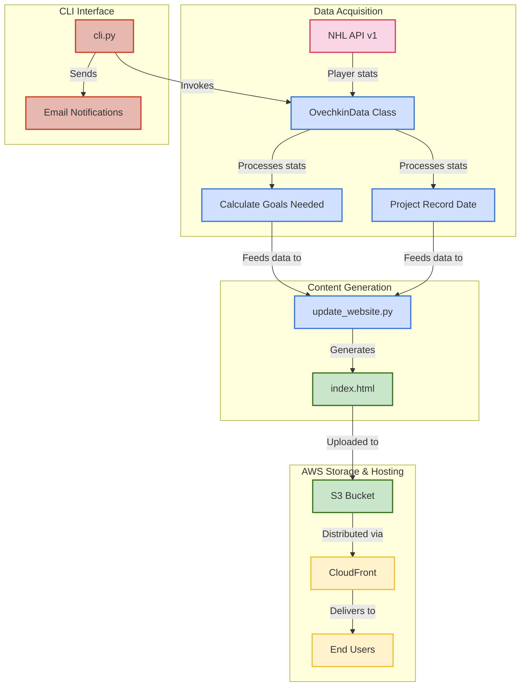
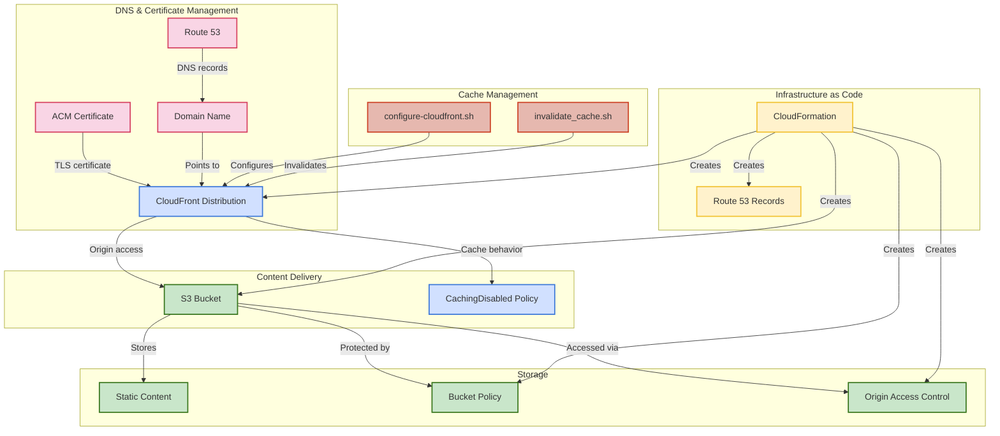
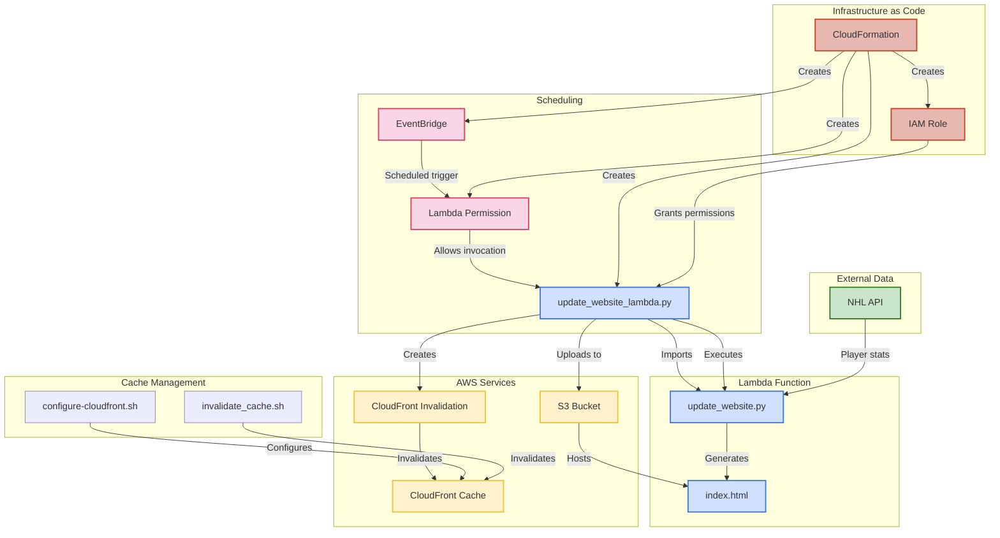
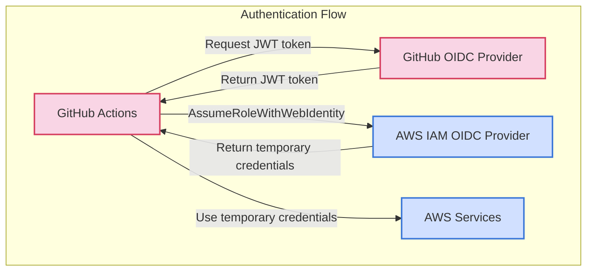

# Ovechkin Goal Tracker Architecture Diagrams

## 1. Ovechkin Data Processing Architecture

The following diagram illustrates the data flow from NHL API acquisition to HTML generation for the Ovechkin Goal Tracker application.



### Data Flow Components

#### 1. Data Acquisition
- **NHL API v1**: External API providing player statistics
- **OvechkinData Class**: Core class that encapsulates data retrieval and processing logic
- **Calculate Goals Needed**: Function calculating remaining goals to break Gretzky's record (894)
- **Project Record Date**: Algorithm projecting the date when Ovechkin might break the record

#### 2. Content Generation
- **update_website.py**: Script that generates website content with the latest stats
- **index.html**: Main website HTML with visualization of progress

#### 3. AWS Storage & Hosting
- **S3 Bucket**: Stores the static website content
- **CloudFront**: Content delivery network for global distribution
- **End Users**: Website visitors viewing Ovechkin's progress

#### 4. CLI Interface
- **cli.py**: Command-line interface for viewing stats and sending notifications
- **Email Notifications**: System for sending goal updates via email

## 2. AWS Infrastructure for Static Site

The following diagram illustrates the AWS infrastructure components used for hosting the Ovechkin Goal Tracker static website.



### Infrastructure Components

#### 1. DNS & Certificate Management
- **Route 53**: AWS DNS service managing domain records
- **Domain Name**: User-provided domain for the website
- **ACM Certificate**: SSL/TLS certificate for secure HTTPS connections

#### 2. Content Delivery
- **CloudFront Distribution**: CDN for global content delivery
- **CachingDisabled Policy**: AWS-managed cache policy (4135ea2d-6df8-44a3-9df3-4b5a84be39ad)

#### 3. Storage
- **S3 Bucket**: Primary storage for website content
- **Static Content**: HTML, CSS, JavaScript, and data files
- **Bucket Policy**: IAM policy restricting access to CloudFront
- **Origin Access Control**: Secure access mechanism for CloudFront

#### 4. Infrastructure as Code
- **CloudFormation**: AWS service for infrastructure provisioning
- **Route 53 Records**: DNS records created by CloudFormation

#### 5. Cache Management
- **configure-cloudfront.sh**: Script to configure cache behaviors
- **invalidate_cache.sh**: Script to invalidate CloudFront cache

## 3. Scheduled Lambda for HTML Upload

The following diagram illustrates the scheduled Lambda function architecture for automatically updating the Ovechkin Goal Tracker website.



### Lambda Architecture Components

#### 1. Scheduling
- **EventBridge**: AWS service for scheduled events
- **Lambda Permission**: IAM permission allowing EventBridge to invoke Lambda

#### 2. Lambda Function
- **update_website_lambda.py**: Lambda handler function
- **update_website.py**: Core script for generating website content
- **index.html**: Generated HTML file with latest stats

#### 3. External Data
- **NHL API**: External API providing player statistics

#### 4. AWS Services
- **S3 Bucket**: Storage for website content
- **CloudFront Invalidation**: Process to clear cached content
- **CloudFront Cache**: CDN cache storing website content

#### 5. Infrastructure as Code
- **CloudFormation**: AWS service for infrastructure provisioning
- **IAM Role**: Role granting Lambda permissions to access AWS services

## 4. GitHub Actions OIDC Authentication Flow (US-330)



### OIDC Authentication Process

1. **Token Request**: When a GitHub Actions workflow runs, it requests a JWT token from GitHub's OIDC provider
2. **Token Verification**: AWS IAM OIDC provider verifies the JWT token from GitHub
3. **Role Assumption**: GitHub Actions calls `AssumeRoleWithWebIdentity` with the JWT token
4. **Temporary Credentials**: AWS STS returns temporary security credentials
5. **AWS Access**: GitHub Actions uses the temporary credentials to access AWS services

### Benefits of OIDC Authentication

- **Enhanced Security**: Eliminates the need for long-lived AWS access keys stored in GitHub secrets
- **Temporary Access**: Credentials are short-lived and automatically rotated
- **Fine-grained Control**: IAM role trust policy can restrict access based on GitHub repository, branch, or environment
- **Audit Trail**: All access is logged in AWS CloudTrail for compliance and security monitoring

### Implementation Components

- **CloudFormation Template**: `github_oidc.yaml` defines the IAM OIDC provider and role
- **Setup Script**: `setup_oidc.sh` automates the deployment and configuration
- **GitHub Actions Workflow**: Updated to use OIDC authentication instead of AWS access keys

## Deployment Commands

### Deploy Static Website Infrastructure
```bash
./aws-static-website/scripts/deploy.sh --domain example.com --region us-east-1
```

### Deploy Website Updater Lambda
```bash
./aws-static-website/scripts/deploy_updater.sh --schedule 'rate(30 minutes)' --region us-east-1
```

### Update Website Content Manually
```bash
./aws-static-website/run.sh update-content
```

### Invalidate CloudFront Cache
```bash
./aws-static-website/run.sh invalidate-cache
